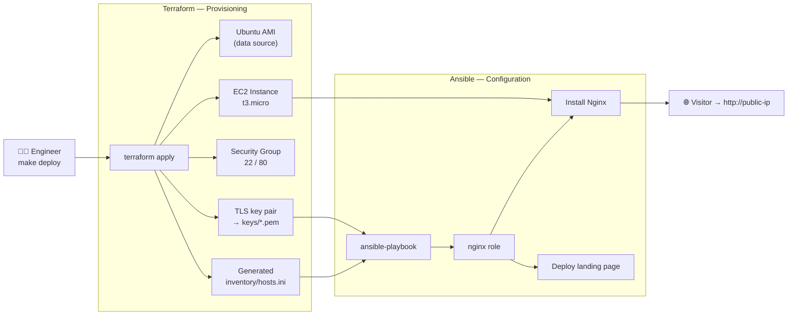

# Terraform + Ansible Hub

> Provision an AWS EC2 web server with **Terraform**, then configure **Nginx** on it with **Ansible** — a clean, modular, CI-validated Infrastructure-as-Code reference project.

<p align="center">
  <a href="https://github.com/memumerafzal/terraform-ansible-hub/actions/workflows/ci.yml">
    
  </a>
  
  
  
  
</p>

---

## ⚡ TL;DR

**One command spins up a live web server on AWS — infrastructure and software fully automated, nothing done by hand.**

```bash
make deploy    # Terraform builds an EC2 server → Ansible installs Nginx → prints a live URL
make destroy   # tears it all back down
```

- **What it does:** `make deploy` has Terraform provision the cloud infrastructure (finds the latest Ubuntu AMI, creates a firewall, generates an SSH key, launches an EC2 instance) and then hands off to Ansible, which connects in and configures Nginx to serve a styled landing page — end to end, zero manual clicking.
- **Why it exists:** a portfolio piece proving hands-on **Infrastructure-as-Code** skill — provisioning (Terraform), configuration management (Ansible), the automatic hand-off between them, plus **CI/CD** that lints, validates, and security-scans every commit.
- **Demoable for free:** the GitHub Actions CI validates and security-scans the code on every push **without touching AWS or costing anything** — the green checkmark *is* the demo. Add AWS keys only when you want a live site.

## 📖 Overview

This project demonstrates the two halves of Infrastructure as Code working together:

- **Terraform** handles *provisioning* — the immutable layer: VPC lookup, security group, SSH key pair, and an EC2 instance.
- **Ansible** handles *configuration* — the idempotent layer: installing and configuring Nginx and deploying a landing page.

The two are wired together automatically: **Terraform generates the SSH key and the Ansible inventory from live state**, so there is no manual copy-pasting of IP addresses or key paths.

## 🏗️ Architecture



**Flow:** `terraform apply` resolves the latest Ubuntu AMI, generates an SSH key pair, creates the security group + EC2 instance, then renders a ready-to-use Ansible inventory. `ansible-playbook` reads that inventory, connects with the generated key, and configures Nginx.

## ✨ Highlights

- **Modular Terraform** — reusable `network` and `compute` modules, not one flat file.
- **No hard-coded AMIs** — the latest Ubuntu 22.04 LTS AMI is resolved dynamically per region.
- **Zero manual wiring** — the SSH key and Ansible inventory are generated from Terraform state.
- **Idempotent Ansible role** — proper `tasks` / `handlers` / `templates` / `defaults` structure with a Jinja2-templated landing page.
- **Secure by default** — IMDSv2 required, encrypted EBS root volume, SSH CIDR is a variable (lock it to your IP), and secrets are git-ignored.
- **CI/CD** — GitHub Actions runs `fmt`, `validate`, `tflint`, `tfsec`, `ansible-lint`, and `yamllint` on every push and PR.
- **Great DX** — one-command `make deploy` / `make destroy`.

## 📁 Project structure

```
terraform-ansible-hub/
├── .github/workflows/ci.yml     # fmt, validate, tflint, tfsec, ansible-lint
├── terraform/
│   ├── main.tf                  # data sources, key pair, module wiring, inventory gen
│   ├── variables.tf outputs.tf providers.tf versions.tf backend.tf
│   ├── terraform.tfvars.example
│   ├── templates/inventory.tpl  # Ansible inventory template
│   └── modules/
│       ├── network/             # security group
│       └── compute/             # EC2 instance
├── ansible/
│   ├── ansible.cfg  playbook.yml
│   ├── inventory/               # hosts.ini generated by Terraform (git-ignored)
│   └── roles/nginx/             # tasks, handlers, templates, defaults, meta
├── scripts/deploy.sh destroy.sh
├── Makefile
└── README.md
```

## 🚀 Quickstart

### Prerequisites

- [Terraform](https://developer.hashicorp.com/terraform/downloads) ≥ 1.5
- [Ansible](https://docs.ansible.com/ansible/latest/installation_guide/intro_installation.html) ≥ 2.14
- [AWS CLI](https://docs.aws.amazon.com/cli/latest/userguide/getting-started-install.html) configured with credentials (`aws configure`)

### Deploy

```bash
# 1. (optional) customise your settings
cp terraform/terraform.tfvars.example terraform/terraform.tfvars
#    then edit region, instance_type, and lock allowed_ssh_cidr to your IP

# 2. provision + configure in one step
make deploy
```

When it finishes, open the printed `http://<public-ip>` in your browser.

### Run the steps individually

```bash
make init        # terraform init
make plan        # review the plan
make apply       # provision infrastructure (generates key + inventory)
make configure   # run the Ansible playbook
```

### Tear down

```bash
make destroy
```

## 🔧 Configuration

| Variable            | Default     | Description                                 |
| ------------------- | ----------- | ------------------------------------------- |
| `region`            | `us-east-1` | AWS region to deploy into                   |
| `instance_type`     | `t3.micro`  | EC2 instance size                           |
| `allowed_ssh_cidr`  | `0.0.0.0/0` | **Lock this to your own IP** (`x.x.x.x/32`) |
| `allowed_http_cidr` | `0.0.0.0/0` | CIDR allowed to reach the website           |
| `environment`       | `dev`       | Environment tag                             |

The landing page content (title, heading, tagline) is configurable in
[`ansible/roles/nginx/defaults/main.yml`](ansible/roles/nginx/defaults/main.yml).

## ✅ Continuous Integration

Every push and pull request runs the following checks — **no AWS credentials or live infrastructure required**:

| Check          | Tool                   |
| -------------- | ---------------------- |
| Formatting     | `terraform fmt -check` |
| Validation     | `terraform validate`   |
| Terraform lint | `tflint`               |
| Security scan  | `tfsec`                |
| Ansible lint   | `ansible-lint`         |
| YAML lint      | `yamllint`             |

## 🔒 Security notes

- **State is local by default** for easy demoing. For real use, enable the S3 + DynamoDB backend in [`terraform/backend.tf`](terraform/backend.tf).
- The SSH private key is generated by Terraform into `terraform/keys/` and is **git-ignored** — it never enters version control.
- `terraform.tfvars` and all `*.pem` / `*.tfstate` files are git-ignored.
- Restrict `allowed_ssh_cidr` to your own IP before any non-throwaway deployment.

## 📜 License

[MIT](LICENSE) © Umer Afzal
